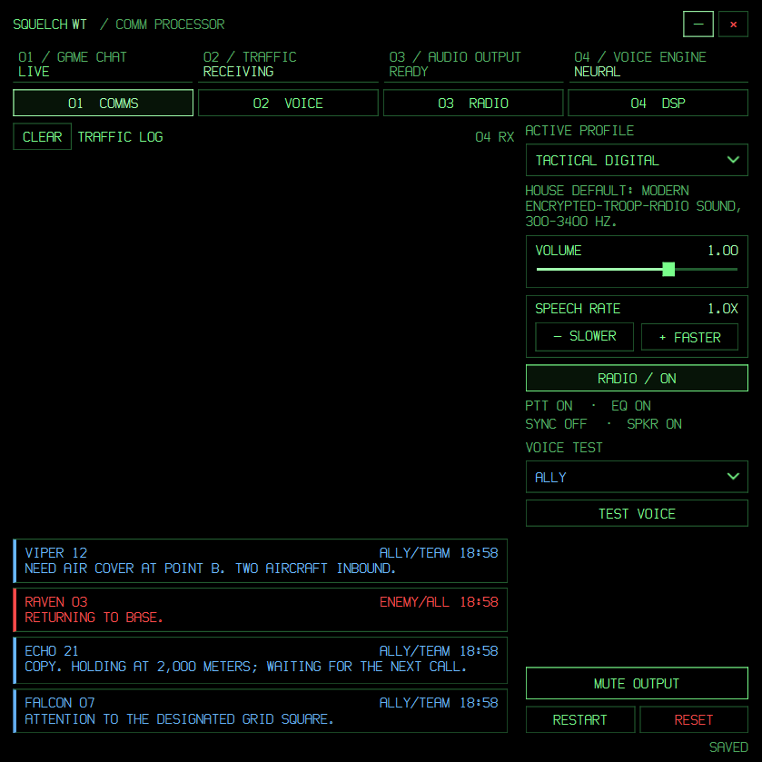

# SquelchWT

SquelchWT reads War Thunder's local game chat and speaks it through a configurable radio effect in a compact 700×700 desktop display. It supports online neural voices and downloadable offline voices for allies and enemies.

# Download: 
On the [Releases page](../../releases), download `SquelchWT-Windows-x64.zip`, extract the complete folder, and run `SquelchWT.exe`. Windows 64-bit is required. Start War Thunder first, then leave SquelchWT open while playing. No Python or FFmpeg installation is needed for the download. An internet connection is needed for neural speech and to download offline voice models. If Windows SmartScreen warns about the unsigned community app, use its normal review flow only if you trust the source and release.

**License:** You may use, study, modify, and redistribute this project for noncommercial purposes under [PolyForm Noncommercial 1.0.0](LICENSE). This is source-available software, not OSI open source, because commercial use is restricted. Dependencies and downloaded voice models have their own licenses. SquelchWT is an independent community project and is not affiliated with Gaijin Entertainment.



Settings, downloaded models, and logs for the packaged app live in `%LOCALAPPDATA%\SquelchWT`. The source checkout uses its own local files. To move settings from a source checkout, copy `config.json` and any desired `voices` models into that app-data directory while the packaged app is closed.

## Tech stack

| Layer | Details |
|---|---|
| OS / Python | Windows, Python 3.14 (tested). See `.venv/` |
| GUI | PySide6 6.11.2, fixed 700×700 frameless `Qt.Window`, native taskbar/Alt-Tab, DPI-aware (`PassThrough`) |
| Font | Installed **Hornet Display Bold**, fallback Bahnschrift. No font files bundled |
| TTS neural | `edge-tts` 7.2.8 + miniaudio MP3 decoding (24 kHz mono) |
| TTS offline | `piper-tts` 1.8.0 models in `voices/` + Windows SAPI fallback |
| DSP | `numpy` 2.5.3, `scipy` 1.18.1. Optional `pedalboard` (compressor) and Opus bindings — both degrade gracefully |
| Audio out | `winsound` with `SND_MEMORY \| SND_NODEFAULT` |

Full pins: `requirements.txt`.

## Repository map

| Path | What it is — AI edit guide |
|---|---|
| `server.py` | Entry point + single-instance lock (`127.0.0.1:48711`). Start here for startup flow |
| `engine.py` | Qt-independent core: `API_ROOT`, `POLL_MS`, `NEURAL_VOICES`, `PIPER_PRESETS`, `DSP_DEFAULTS`, `DSP_SLIDERS`, `PROFILES`, `RadioService`, `fetch_chat`, `normalize_slang`, TTS, queues, config load/save |
| `radio_processor.py` | Standalone DSP: `RadioConfig` dataclass + `RadioProcessor.process(audio, sample_rate)`. CLI-runnable WAV converter/self-test. No Qt imports |
| `ui/window.py` | `MainWindow` + `Dispatcher` (queued `posted` signal for worker→GUI delivery) |
| `ui/settings.py` | `VoicePage`, `RadioPage`, `DspPage` (6 DSP groups) |
| `ui/transmissions.py` | `TransmissionLog` — 80-record read-only log |
| `ui/theme.py`, `ui/widgets.py`, `ui/help_text.py` | Semantic colors, reusable controls (`Selector`, `Parameter`, `Annunciator`, `TitleBar`), tooltip strings |
| `ui/chevron.svg` | Icon asset |
| `config.json` | Persisted user settings; local in source runs, under `%LOCALAPPDATA%\SquelchWT` in the packaged app |
| `config.backup.json` | Previous `config.json`, written on RESET ALL |
| `slang.json` | 76 lowercase whole-word `abbr → speech` mappings |
| `muted_phrases.json` | `{exact:[12], starts_with:[6]}` built-in radio phrases muted when toggle is on |
| `voices/` | Downloaded Piper `.onnx` + `.json` pairs (git-ignored models) |
| `tests/test_avionics.py` | 29 Qt integration tests (temp config, real controls) |
| `tests/launch_check.py` | Window identity, minimize style, singleton lock, graceful exit |
| `tests/visual_check.py` | Renders all pages/groups with synthetic fixtures; checks overflow/clipping |
| `tests/performance_check.py` | Idle CPU/mem, poll ticks, progress redraw, local synth + DSP timing |
| `tests/smoke_audio.py` | Opt-in audible end-to-end LOCAL + NEURAL check |
| `docs/DESIGN.md` | Design research, decisions, validation numbers |
| `docs/screenshot.png` | Example COMMS display |

## Quickstart

```powershell
# fresh env
py -3.14 -m venv .venv
.venv\Scripts\python.exe -m pip install -r requirements.txt
.venv\Scripts\pythonw.exe server.py

# build a portable Windows ZIP (developer workflow)
.venv\Scripts\python.exe -m pip install -r requirements-build.txt
.venv\Scripts\python.exe tools\build_release.py
```

Window: fixed square 700×700 logical px, borderless, in taskbar, not always-on-top. Drag the title area; minimize/close controls or Alt+F4. Four annunciators (`GAME CHAT / TRAFFIC / AUDIO OUTPUT / VOICE ENGINE`) stay independent so MUTED never hides NO LINK. Tooltips show immediately; DSP sliders also explain on keyboard focus.

Pages: **COMMS** (log) · **VOICE** (engines/models) · **RADIO** (master, profiles, codec, toggles) · **DSP** (6 slider groups). Sidebar always has profile selector, volume, speed, radio master, voice test, mute, reset, restart.


## Data flow

```text
War Thunder chat HTTP endpoint (API_ROOT in engine.py)
        ↓ poll every 100 ms (RadioService.poll / poll_once)
Slang normalization (normalize_slang + slang.json)
        ↓
Speech synthesis (edge_tts NEURAL @24k mono | Piper LOCAL + SAPI fallback)
        ↓ mono PCM at synthesizer native rate
Radio DSP (RadioProcessor.process → narrowband 8 kHz default)
        ↓ WAV bytes
winsound playback + TransmissionLog row
```

Key contracts:

- `fetch_chat(last_id)`: `GET {API_ROOT}/gamechat?lastId=<id>`, 0.35 s timeout, one keep-alive `http.client` connection, one retry on fresh connection. Record fields: `id, sender, msg, mode, enemy` (all defensive).
- `normalize_slang(text)`: whole-word, case-insensitive via `SLANG_RE = (?<!\w)([\w']+)(?!\w)`; punctuation preserved.
- `is_default_radio_message(text)`: case/whitespace/punctuation-folded match against `muted_phrases.json`.
- `RadioProcessor.process(audio, sample_rate, profile=False) -> (out, sr)`: never raises to caller — `engine.py` falls back to dry audio + warning on DSP failure.
- Threading: `pending(max 8)` → `ThreadPoolExecutor(max 3)` synth futures → `play_queue(max 3)` → `player_worker`. One `RadioProcessor` per synth thread. Utterances snapshot `cfg['radio']` under `cfg_lock`. `Dispatcher.posted` (queued Qt signal) is the only worker→GUI path; disabled on shutdown.

## Game-chat input

- The app connects to `http://127.0.0.1:8111/gamechat?lastId=…` on the **same PC** as War Thunder. It does not depend on the player's LAN IP. To use a different host or port deliberately, set `SQUELCHWT_API_ROOT` to an HTTP(S) origin before starting the app.
- Log holds **80 records** in normal chat order (newest at bottom, auto-follow). Row: sender, channel, explicit ALLY/ENEMY label, local receipt time (not server time). Ally = blue, enemy = red, card outline = green. Plain text only.
- **MUTE DEFAULT MESSAGES** (`radio.mute_default_messages`): matched rows stay visible but are not synthesized. `exact` ignores case + trailing `!?.,;:`; `starts_with` matches `prefix` or `prefix + ' …'`.
- Enemy + `All`-mode messages get heavier degradation (`enemy_noise_mult`, `enemy_drop_mult` in `RadioConfig`).

## Slang normalization

`slang.json` = 76 entries. Examples: `ggwp→gg well played`, `br→battle rating`, `rb→realistic battle`, `ab→arcade battle`, `sb→simulator battle`, `sl→silver lions`, `rp→research points`, `sp→spawn point`, `tking→team killing`, `tked→team killed`. To add one: lowercase key, speakable value, whole-word only — no code change needed (`load_slang()` at import).

## Speech synthesis

- **NEURAL** (`engine_mode=NEURAL`): 12 presets in `NEURAL_VOICES`; defaults ally `en-US-AndrewNeural`, enemy `en-US-BrianNeural`. Requires internet; MP3 decoding is included.
- **LOCAL** (`engine_mode=LOCAL`): independent ally/enemy Piper models from `voices/`; 15 entries in `PIPER_PRESETS` with size MB + download button + % progress. Both `.onnx` and sidecar `.json` required for INSTALLED status; SAPI fallback otherwise. Installed models prewarmed in background (ally first).
- **Speed**: `rate` 0.5–2.5 via SLOWER/FASTER.
- **Test**: phrase `The quick brown fox jumps over the lazy dog.` per engine/role. Overlap-suppressed — new test ignored while one is pending/synthesizing/queued/playing. Tests disabled while muted/busy.

## Radio DSP (`radio_processor.py`)

Narrowband processing (default 8 kHz) with polyphase resample in/out. Stage order in `process()`:

1. Peak normalize → resample to narrowband
2. Bandpass 300–3400 Hz SOS Butterworth (unless EQ off)
3. Tube stage (AM profiles only)
4. Codec round-trip (below)
5. Multipath selective fading (AM only)
6. Presence lift (~2.5 kHz shelf)
7. Hard compressor (default 8:1, −18 dB, 5/100 ms; `pedalboard` or manual follower)
8. Tanh saturation
9. Profile channel: FM pre/de-emphasis + limiting, noisy AM envelope, SSB product detection + tuning error, or digital-codec bypass
10. VOX edge gating (nibbles leading/trailing syllables)
11. TX envelope: optional crypto sync preamble, 1 randomized 5–20 ms dropout, ionospheric fade, DTX-quantized noise bed, carrier ramp, squelch crash/chop, het whistle, PTT click + bounce, squelch tail
12. Slow AGC (AM/HF only, 0.35 Hz, gain 0.6–1.8)
13. Small-speaker resonance (~950 Hz, `speaker_enabled`)
14. Limiter → upsample → `output_gain` × log-mapped VOLUME → ceiling-normalize at 0.98 (no flat-top clipping)

`channel_model=legacy` is an exact bypass — old/custom configs auto-migrate to it; picking a named profile opts into `digital|fm|am|ssb`.

### Codecs

| UI value | Sound |
|---|---|
| `cvsd` | Secure-voice style 1-bit CVSD (Secure Military @16 kbps) |
| `none` | Bypass, maximum clarity |

Backend also accepts via `config.json` only: `lpc` (quantized mixed-excitation vocoder + PLC + bit errors), `melp` (alias → LPC + warning), `opus` (real libopus or LPC fallback). Unknown strings → `cvsd` + logged warning.

### Profiles (`engine.PROFILES`, default `Air Cover`)

| Profile | Character |
|---|---|
| Tactical Digital | Low-rate LPC-family vocoder, no sync tone |
| Clear Signal | Strong FM, 750 µs pre/de-emphasis |
| Secure Military | 16 kbps CVSD secure voice |
| Long Range HF | SSB, 2.7 kHz, tuning error, 2-path fading |
| AM Radio Night | Night MW AM: tube, fading, multipath, het |
| Tube Console | Warm sagging valve console, quiet |
| Shortwave Broadcast | Distant SW: flutter, fading, co-channel het |
| Squad Patrol | Short-range narrowband FM handheld |
| Vehicle Convoy | Vehicle FM, boxier speaker |
| Weak Signal | Low-SNR FM at intelligibility limit |
| Air Cover | **Factory default.** Aviation AM + sync burst, clean LOS |
| Old Walkie | Old noisy FM handheld, strong speaker color |
| Command Post | Base-station FM, broad response |
| Custom | Auto-set after any manual tweak |

`DSP_DEFAULTS` + selected profile fully determine sound. See `PROFILE_INFO` for one-line UI descriptions.

### Advanced controls

34 sliders (`DSP_SLIDERS`: key, label, min, max, step, format) in 6 DSP groups (SIGNAL / CODEC / DYNAMICS / RF / TX / OUTPUT) + CODEC dropdown, SYNC BURST, SPEAKER, PTT/EQ/master toggles. Hover tooltip per control (`DSP_SLIDER_TIPS`); ranges/steps/formats in `DSP_SLIDERS`. Profile modulation internals stay hidden to prevent invalid mixes.

### Volume mapping (`_vol_gain = 10^((v−1)·2)`, slider 0.0–1.5)

| Slider | Gain | Level |
|---:|---:|---:|
| `0.00` | `0.01` | `−40 dB` |
| `0.50` | `0.10` | `−20 dB` |
| `1.00` | `1.00` | `0 dB` |
| `1.25` | `3.16` | `+10 dB` |
| `1.50` | `10.00` | `+20 dB` |

## Configuration (`config.json`)

Top-level: `engine_mode, neural_ally, neural_enemy, piper_ally, piper_enemy, rate, radio{…}`. Legacy `piper_voice` migrates to `piper_ally` (kept as alias). Load = saved JSON merged over `DEFAULT_CONFIG`; missing DSP keys backfilled. Saves: sliders/memory-immediate + 350 ms debounce + flush on close; voice/profile immediate; atomic file replace. RESET ALL → backup to `config.backup.json`, restore defaults, no restart. RESTART → save, drain, release lock socket, and relaunch the current executable. Opening a page never mutates values; out-of-range legacy values display read-only until touched.

## Development & tests

```powershell
.venv\Scripts\python.exe -m unittest discover -s tests -v
.venv\Scripts\python.exe tests/visual_check.py        # renders all pages/groups; check devicePixelRatio
.venv\Scripts\python.exe tests/smoke_audio.py         # OPT-IN audible LOCAL+NEURAL check
.venv\Scripts\python.exe tests/launch_check.py
.venv\Scripts\python.exe tests/performance_check.py
.venv\Scripts\python.exe radio_processor.py --help    # CLI WAV converter / self-test
```

- `test_avionics.py` uses a temp config — safe to run; never touches real `config.json`.
- `visual_check.py`: run on native Windows Qt platform (offscreen misses system fonts). `QT_SCALE_FACTOR` multiplies native DPI — verify via reported ratio.
- Do not commit `.venv/`, `__pycache__/`, `voices/*.onnx`, `squelchwt.log`, `config.backup.json`.

## Logging & troubleshooting

Log: `%LOCALAPPDATA%\SquelchWT\squelchwt.log` for the packaged app; `squelchwt.log` next to the source files for source runs.

| Symptom | Cause / fix |
|---|---|
| `SquelchWT is already running.` | Close the existing app window before starting a second copy |
| `NO LINK`, no traffic | Start War Thunder on the same PC; check whether `http://127.0.0.1:8111/gamechat?lastId=0` responds in a browser |
| Silent NEURAL | Check internet access and voice selection; see the log for the precise error |
| Silent LOCAL / NOT INSTALLED | Missing `.onnx`/`.json` in `voices/` — download in VOICE page; SAPI is fallback |
| Choppy/quiet audio | Check VOLUME mapping, `output_gain`, profile SNR, compressor/squelch settings |

## Extension guide (AI)

- **Add slang**: append `"key": "speakable"` to `slang.json` (lowercase). No restart of code needed — reloaded at startup.
- **Mute a phrase**: add to `muted_phrases.json` under `exact` or `starts_with`. Matching is case/punctuation-insensitive.
- **Add/tune profile**: edit `PROFILES` + `PROFILE_INFO` in `engine.py`; all keys must exist in `DSP_DEFAULTS`. `channel_model` ∈ `legacy|digital|fm|am|ssb`.
- **Add DSP slider**: extend `DSP_DEFAULTS`, `DSP_SLIDERS`, `DSP_SLIDER_TIPS` in `engine.py` + matching field in `RadioConfig` (`radio_processor.py`) + DSP group layout in `ui/settings.py`.
- **Add voice**: extend `NEURAL_VOICES` or `PIPER_PRESETS` in `engine.py` (label, id, size-MB for Piper).
- **Safe invariants**: keep backend Qt-free; worker→GUI only via `Dispatcher.posted`; snapshot radio dict per utterance; keep `pending≤8 / workers=3 / play_queue≤3`; keep WAV output mono 16-bit with peak ≤0.98.

Design sources, preservation inventory, and test limits: [docs/DESIGN.md](docs/DESIGN.md).
